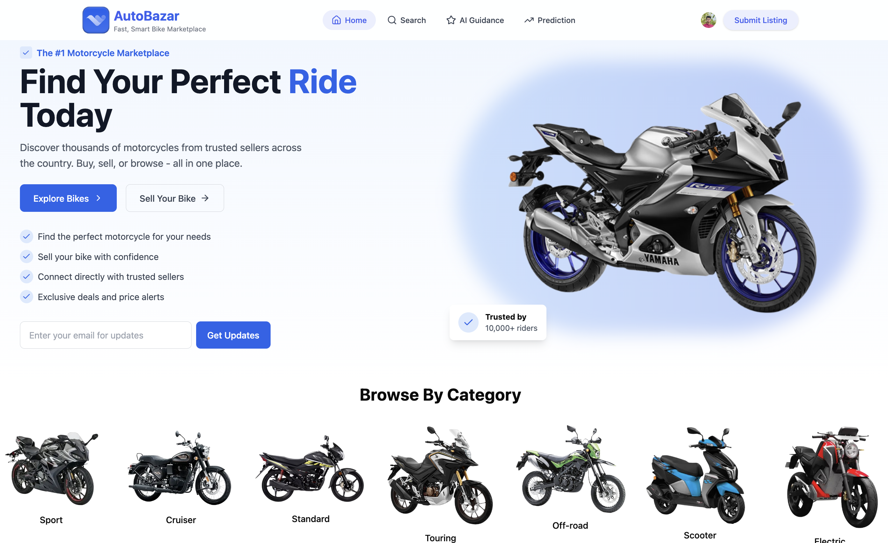

# AutoBazaar 🏍️

AutoBazaar is a smart motorcycle marketplace built with the MERN stack and PostgreSQL, offering users a seamless platform to buy, sell, or rent bikes. It includes AI-powered features for price prediction and guidance, real-time availability, and intuitive brand/category-based filtering.

<p align="center">
  
  <br>
  <br>
  Figure 1: Home Page
</p>


## 🚀 Features

- 🧠 AI-Based Price Prediction  
- 🔍 Smart Search with Filter Options  
- 🏍️ Browse by Brand and Category  
- 📸 Add Motorcycle Listings with Images  
- 🔐 Secure Authentication via Clerk  
- 📊 Real-time Listings and Data Updates  
- 💬 Customer Reviews & Success Stories  

## 📌 Tech Stack

### Frontend
- **React.js** – Component-based UI  
- **Tailwind CSS** – Utility-first styling  
- **Framer Motion** – Smooth UI animations  
- **React Router** – Client-side routing  

### Backend
- **Node.js** & **Express.js** – REST API development  
- **PostgreSQL** – Structured data storage (via Drizzle ORM)  
- **Firebase** – Image and asset storage  
- **Clerk** – Secure user authentication  

## 🗂️ Folder Structure

```
/Users/md.habibunnabihemel/Desktop/AutoBazaar/
├── public/
│   ├── logo.svg
│   ├── bike3.png
│   └── ... (other public assets)
│
├── src/
│   ├── add-listing/
│   │   └── components/
│   │       └── UploadImages.jsx
│   │
│   ├── components/
│   │   ├── ui/
│   │   │   └── button.jsx
│   │   │
│   │   ├── Category.jsx
│   │   ├── Header.jsx
│   │   ├── Hero.jsx
│   │   ├── Search.jsx
│   │   └── ... (other components)
│   │
│   ├── configs/
│   │   ├── firebase.js (or firebaseConfig.js)
│   │   ├── schema.js
│   │   └── index.js
│   │
│   ├── data/
│   │   └── searchData.js
│   │
│   ├── Shared/
│   │   └── Data.js
│   │
│   ├── App.jsx
│   ├── main.jsx
│   └── ... (other source files)
│
├── package.json
├── vite.config.js
└── ... (other config files)
```

## 🔐 Authentication

- Powered by **Clerk** – Supports email/password and social login.  
- Authenticated users can submit and manage listings securely.  

## 🤖 AI Features(working)

- **Price Prediction**: Users can input bike details and get an estimated market price.  
- **Guided Suggestions**: Intelligent suggestions for finding the perfect motorcycle.  

## 🛠️ Setup & Installation

1. **Clone the repository**
```bash
git clone https://github.com/your-username/AutoBazaar.git
cd AutoBazaar
```

2. **Install dependencies**
```bash
# For frontend
cd client
npm install

# For backend
cd ../server
npm install
```

3. **Set environment variables**

Create a `.env` file in the root and add necessary credentials:

```env
VITE_CLERK_PUBLISHABLE_KEY=your_key_here
VITE_FIREBASE_CONFIG=your_firebase_config
DATABASE_URL=your_postgres_url
```

4. **Run the project**
```bash
# Run backend
cd server
npm run dev

# Run frontend
cd ../client
npm run dev
```

## 🌱 Future Scope

- In-app messaging between buyers and sellers  
- Motorcycle financing integration  
- Escrow-based payment system  
- AI recommendation engine  
- Native iOS/Android app  
- Maintenance history and inspection reports  

## 🎥 Project Walkthrough

[Click here to watch the walkthrough](#) <!-- Replace # with your YouTube or Loom link -->

## 🙌 Acknowledgements

- OpenAI (for AI tools & guidance)  
- Firebase & Clerk for backend services  
- Drizzle ORM for type-safe database access  

## 👨‍💻 Author

**Habibun Nabi Hemel**  
[GitHub](https://github.com/your-username) | [Portfolio](https://hemel-portfolio.vercel.app/) | [LinkedIn](https://www.linkedin.com/in/habibun-nabi-hemel/)

---

> **AutoBazaar** – The #1 Smart Motorcycle Marketplace for Fast, Transparent, and Intelligent Bike Deals 🚀
